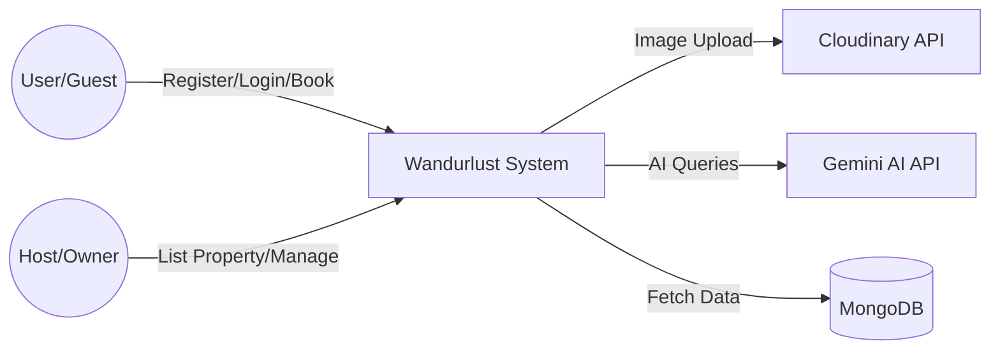
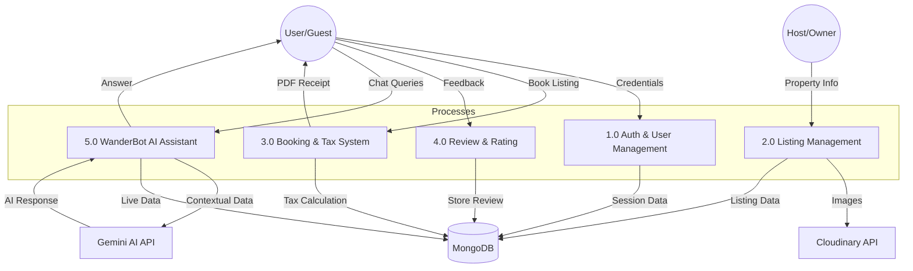

# Project Report: Wandurlust 🌍
**A Premium Full-Stack Travel & Listing Platform**

---

## 📄 Abstract
Wandurlust is a full-stack web application designed to provide a seamless platform for travelers to find and book unique stays and for hosts to list their properties. Inspired by Airbnb, the system integrates modern web technologies, real-time communication, and AI-driven assistance to create a premium user experience. Key highlights include a robust MVC architecture, real-time chat, and an AI-powered travel assistant (WanderBot).

---

## 1. Introduction
### 1.1 Overview
The travel industry relies heavily on digital platforms to connect users with hosts. Wandurlust aims to simplify this connection by offering an intuitive interface, secure authentication, and dynamic listing management.

### 1.2 Objectives
- To develop a secure platform for property listing and booking.
- To implement real-time communication between hosts and guests.
- To integrate AI for enhanced user support and contextual property recommendations.
- To provide interactive mapping and geolocation services.

---

## 2. Methodology
Wandurlust was developed using an **Iterative Development Lifecycle**, ensuring continuous improvement and feature integration.

1.  **Requirement Analysis**: Identifying the core needs of a travel platform (CRUD, Auth, Search).
2.  **System Design**: Drafting the MVC architecture, designing the schema for MongoDB, and creating UI wireframes with a focus on glassmorphism.
3.  **Core Implementation**: Developing the backend with Node.js and Express, and frontend rendering with EJS.
4.  **Feature Integration**: 
    - Integrating **Cloudinary** for scalable image management.
    - Implementing **Passport.js** for robust session-based authentication.
    - Integrating **Socket.io** for real-time bidirectional messaging.
5.  **AI Orchestration**: Developing the **WanderBot** service to bridge Google Gemini AI with the application's database.
6.  **Testing & Optimization**: Performing manual route testing, UI responsiveness checks, and AI response validation.

---

## 3. Tools & Technologies

### 3.1 Software Tools
- **Code Editor**: VS Code
- **Version Control**: Git & GitHub
- **Environment Management**: Dotenv
- **API Testing**: Postman / Browser DevTools

### 3.2 Frontend Technologies
- **HTML5 & EJS**: Structure and templating.
- **CSS3**: Custom glassmorphism styling and animations.
- **Bootstrap 5**: Responsive grid system.
- **Leaflet.js**: Open-source maps and routing.

### 3.3 Backend Technologies
- **Node.js**: Runtime environment.
- **Express.js**: Backend framework.
- **Socket.io**: Real-time event-based communication.
- **Passport.js**: Authentication middleware.

### 3.4 Database & Storage
- **MongoDB Atlas**: Cloud NoSQL database.
- **Mongoose**: ODM for MongoDB.
- **Cloudinary**: Cloud image storage and optimization.

### 3.5 AI & External APIs
- **Google Gemini API**: Advanced LLM for WanderBot.
- **wttr.in**: Real-time weather data.
- **PDFKit**: For generating booking receipts.

---

## 4. Data Flow Diagrams (DFD)

### 2.1 Level 0: Context Diagram
The Context Diagram shows the system's boundaries and its interaction with external entities.

### 2.2 Level 1: Data Flow Diagram (Recommended)
Level 1 DFD breaks the system into its primary functional modules.

---

## 3. Technical Stack

### 3.1 Frontend
- **EJS (Embedded JavaScript)**: For server-side rendering of dynamic content.
- **Vanilla CSS3**: Custom styles featuring glassmorphism and animations.
- **Bootstrap 5**: For responsive layout design.
- **Leaflet.js**: For interactive map integration.

### 3.2 Backend
- **Node.js & Express.js**: The core server-side framework.
- **Socket.io**: For real-time messaging and notifications.
- **Passport.js**: For secure session-based authentication.

### 3.3 Database
- **MongoDB**: NoSQL database for flexible and scalable data storage.
- **Mongoose**: ODM (Object Data Modeling) for MongoDB.

### 3.4 External APIs
- **Cloudinary**: For cloud-based image hosting and optimization.
- **Google Gemini API**: To power the WanderBot AI assistant.
- **wttr.in**: For live weather updates.

---

## 4. System Architecture
Wandurlust follows the **MVC (Model-View-Controller)** design pattern, ensuring a clean separation of concerns:
- **Models**: Define the data structure (User, Listing, Booking, Review, Chat).
- **Views**: The UI templates rendered using EJS.
- **Controllers**: Contain the business logic and handle incoming requests.

---

## 5. Advanced Features

### 5.1 WanderBot AI Assistant
WanderBot is a state-of-the-art AI assistant integrated using the Google Gemini API. It provides:
- **Contextual Knowledge**: Accesses real-time listing data directly from the database.
- **Multilingual Support**: Communicates in English, Hindi, and Hinglish.
- **Reliability**: Uses a fallback mechanism across multiple Gemini models.

### 5.2 Real-time Messaging
Powered by Socket.io, users and hosts can communicate instantly. It features:
- Live message updates.
- Unread message badges.
- Message history persistence in MongoDB.

---

## 6. Conclusion
Wandurlust successfully demonstrates the integration of modern web technologies to create a functional and aesthetic travel platform. The addition of AI and real-time features elevates it from a standard CRUD application to a premium digital product.

### 6.1 Future Enhancements
- Integration of a payment gateway (e.g., Stripe/Razorpay).
- Implementation of a mobile application using React Native.
- Advanced filtering and AI-based personalized recommendations.
