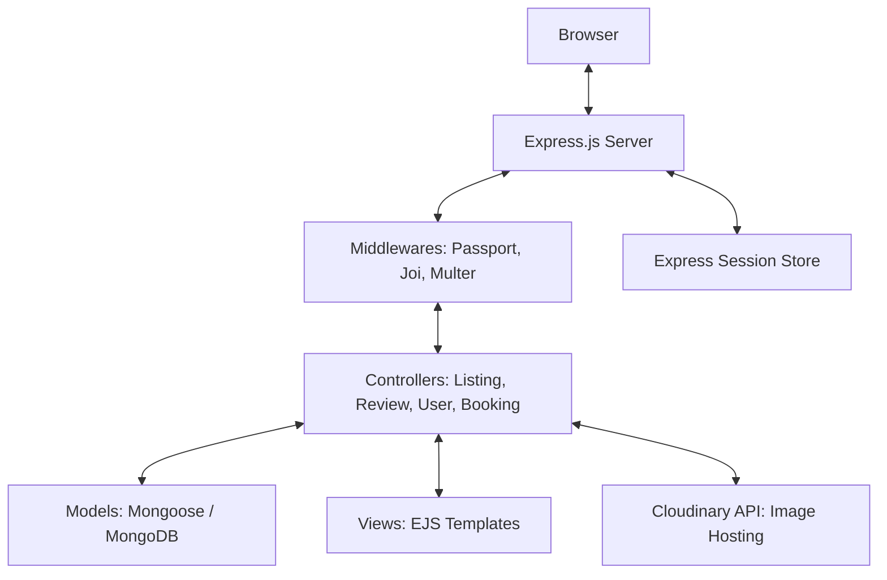

# Wandurlust System Architecture

Wandurlust is a full-stack, server-side rendered application built on the **MVC (Model-View-Controller)** architecture. It provides a platform for users to list, discover, and book properties, similar to Airbnb.

## 🏛️ High-Level Architecture
Wandurlust follows a monolithic architecture where the backend, business logic, and frontend templates are co-located in a single Express.js application.

## 🗺️ Key Components

### 1. **Routing System**
The application uses Express Router to organize routes logically:
- `/listings`: CRUD operations for property listings.
- `/listings/:id/reviews`: Nested routes for property reviews.
- `/users`: Authentication routes (Signup, Login, Logout).
- `/bookings`: User bookings and host dashboard.

### 2. **Security & Authentication**
- **Passport.js**: Handles user sessions and authentication logic using the `passport-local` strategy.
- **Bcrypt (via passport-local-mongoose)**: Secure password hashing.
- **Session-Based Auth**: Uses `express-session` for maintaining user state.
- **Middleware Guards**: Custom middlewares like `isLoggedIn`, `isOwner`, and `isReviewAuthor` ensure data integrity and authorization.

### 3. **Data Validation**
- **Joi Schemas**: Server-side validation for listing and review data before database insertion, ensuring only clean and properly formatted data is stored.

### 4. **Storage Strategy**
- **MongoDB**: Primary database for metadata (listings, reviews, users, bookings).
- **Cloudinary**: External cloud storage for property images. `Multer` is used to handle file uploads as `multipart/form-data`.

## 🗄️ Database Schema Design

The application uses **Mongoose (MongoDB)** with a relational-like approach using ObjectId references:

### **Listing Model**
| Field | Type | Description |
| :--- | :--- | :--- |
| `title` | String | Name of the property |
| `description` | String | Details about the property |
| `image` | Object | Contains `url` and `filename` (Cloudinary) |
| `price` | Number | Cost per night |
| `location` | String | City/Area |
| `country` | String | Country name |
| `owner` | ObjectId | Reference to `User` |
| `reviews` | Array | References to `Review` objects |

### **Review Model**
| Field | Type | Description |
| :--- | :--- | :--- |
| `comment` | String | User feedback |
| `rating` | Number | 1-5 stars |
| `author` | ObjectId | Reference to `User` |
| `createdAt` | Date | Timestamp of review |

### **User Model**
| Field | Type | Description |
| :--- | :--- | :--- |
| `email` | String | Unique user email |
| `username` | String | Unique username (handled by Passport) |
| `password` | String | Hashed password (handled by Passport) |

### **Booking Model**
| Field | Type | Description |
| :--- | :--- | :--- |
| `listing` | ObjectId | Reference to `Listing` |
| `user` | ObjectId | Reference to `User` (Guest) |
| `checkIn` | Date | Start of stay |
| `checkOut` | Date | End of stay |
| `totalPrice` | Number | Calculated cost |
| `isNewBooking` | Boolean | Notification flag for hosts |

## 🎨 Frontend & UX
- **Templating**: EJS with `ejs-mate` for layouts (header, footer, common elements).
- **Styling**: Vanilla CSS for a custom premium look, featuring glassmorphism and modern UI components.
- **Interactivity**: Client-side JS for simple UI effects and data submission.

## 🚀 Performance & Scalability
- **Connection Pooling**: MongoDB connections are managed via Mongoose's built-in pooling.
- **Image Optimization**: Cloudinary automatically optimizes and serves images via CDN.
- **Index-based Queries**: Common fields like user IDs and listing IDs are indexed for faster retrieval.
